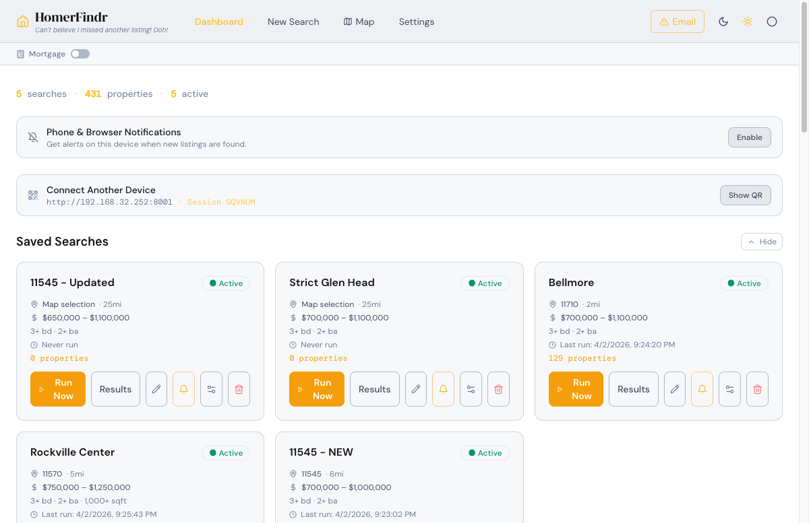
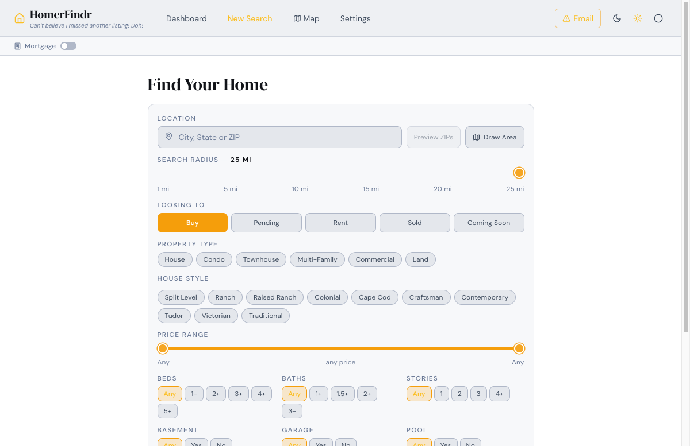
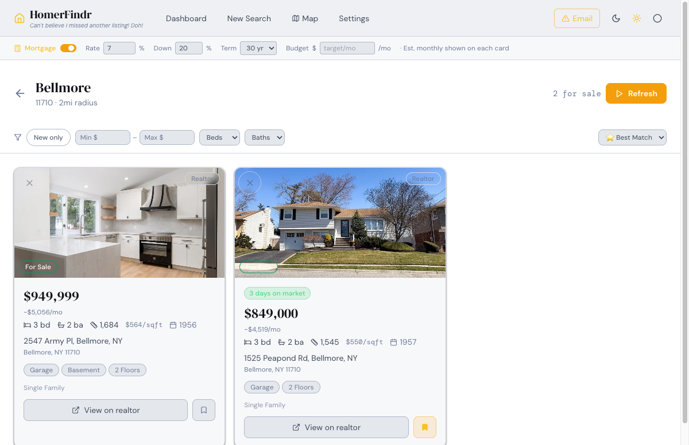
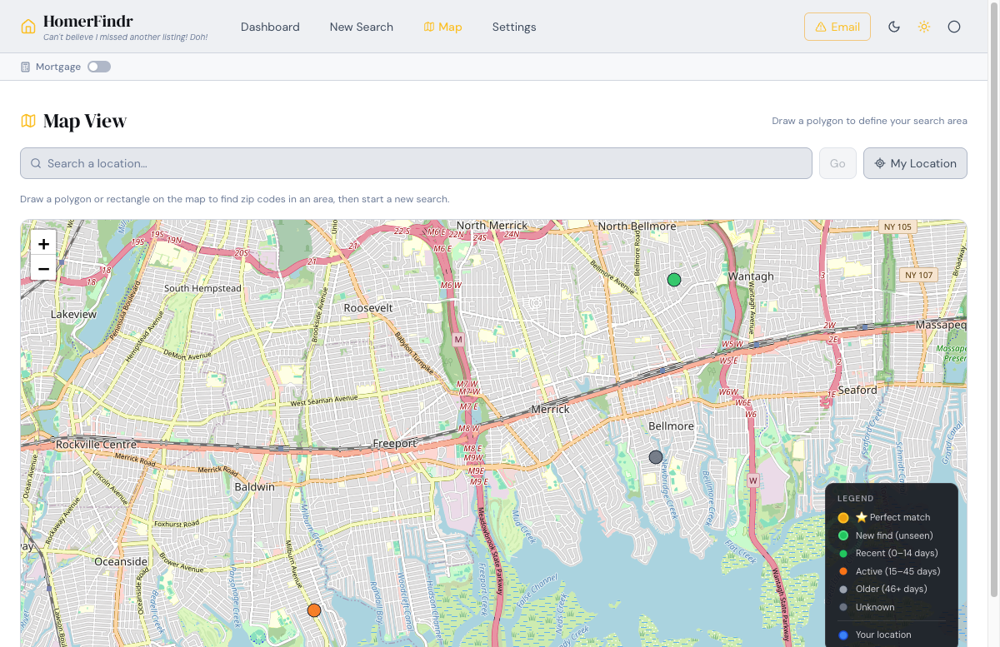
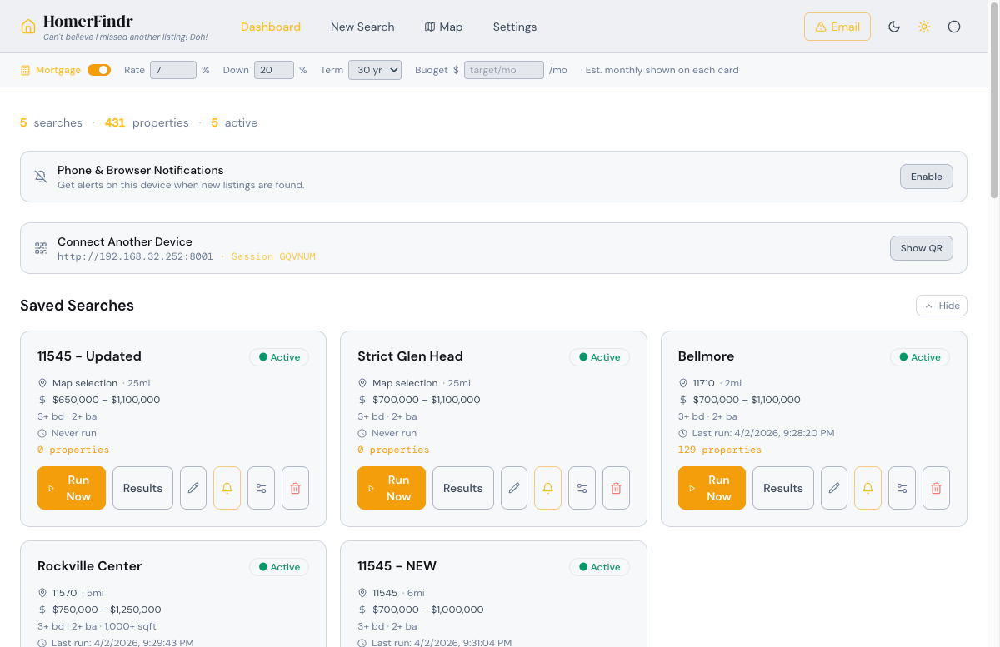
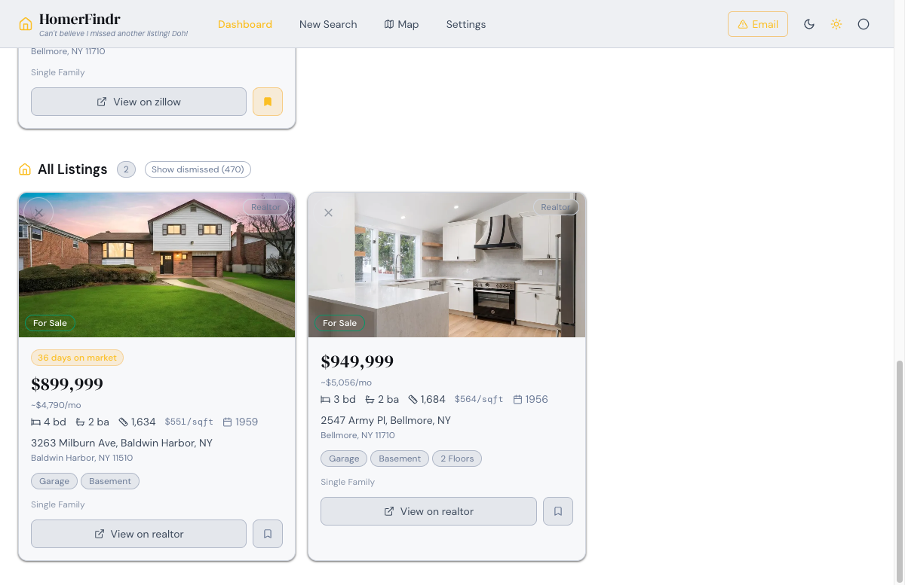
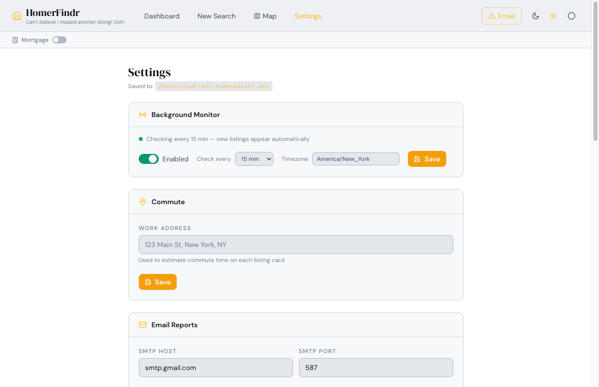

<div align="center">

```
██╗  ██╗ ██████╗ ███╗   ███╗███████╗██████╗ 
██║  ██║██╔═══██╗████╗ ████║██╔════╝██╔══██╗
███████║██║   ██║██╔████╔██║█████╗  ██████╔╝
██╔══██║██║   ██║██║╚██╔╝██║██╔══╝  ██╔══██╗
██║  ██║╚██████╔╝██║ ╚═╝ ██║███████╗██║  ██║
╚═╝  ╚═╝ ╚═════╝ ╚═╝     ╚═╝╚══════╝╚═╝  ╚═╝
███████╗██╗███╗   ██╗██████╗ ██████╗ 
██╔════╝██║████╗  ██║██╔══██╗██╔══██╗
█████╗  ██║██╔██╗ ██║██║  ██║██████╔╝
██╔══╝  ██║██║╚██╗██║██║  ██║██╔══██╗
██║     ██║██║ ╚████║██████╔╝██║  ██║
╚═╝     ╚═╝╚═╝  ╚═══╝╚═════╝ ╚═╝  ╚═╝
```

### *"Can't believe I missed another listing! Doh!"*

**Search every home listing. Find the one.**

Pulls listings from Realtor.com, Redfin, and Zillow into one place — with a polished CLI and a full web dashboard. No browser juggling. No missed listings.

[](https://github.com/iamtr0n/HomerFindr/releases)
[](https://www.python.org/)
[](https://github.com/iamtr0n/HomerFindr)
[](LICENSE)

[Install](#-install) · [Web Dashboard](#-web-dashboard) · [CLI](#-cli) · [Alerts](#-alerts--sms) · [Developers](#-for-developers)

</div>

---

## What is HomerFindr?

You know the feeling — you open Zillow, find the perfect house, and realize it's been on the market for 18 days. The open house was two weekends ago. Someone already has an offer in. You missed it.

That's not bad luck. That's how Zillow works. Their apps are designed to keep you browsing, not to get you into a home fast. Alerts are delayed, results are filtered by what they want to show you, and you're never quite seeing the full picture.

**HomerFindr fixes this.**

It's a home search aggregator that runs on your own machine and checks Realtor.com (MLS), Redfin, and Zillow simultaneously — on your schedule, as often as every few minutes. The moment a new listing hits any of those platforms, HomerFindr finds it, scores it against your filters, and texts you. Not tomorrow. Not "when Zillow feels like it." Now.

Every listing is ranked by how well it matches *your* criteria — beds, baths, price, garage, basement, school rating, commute zone, you name it. The best matches float to the top. You see everything, deduplicated and sorted, in one place.

| The old way | With HomerFindr |
|-------------|-----------------|
| Check 3 apps manually, multiple times a day | One dashboard, all sources, auto-refreshed |
| Get a Zillow alert 2 weeks after listing | SMS the moment it hits any platform |
| Miss the open house because you found it too late | First to know = first to schedule a showing |
| Scroll through hundreds of irrelevant listings | Match scores surface your best fits instantly |
| Lose a perfect house to a faster buyer | You're the faster buyer |

It has two interfaces that share the same data:

| Interface | Best for |
|-----------|----------|
| **Web Dashboard** | Browsing, filtering, saving, and tracking listings visually |
| **CLI (Terminal)** | Power users, quick searches, arrow-key navigation with zero typing |

Everything persists locally in SQLite. Saved searches run on a schedule and send desktop notifications or SMS alerts when new listings appear.

---

## ✨ Features at a Glance

- **3 data sources** — Realtor.com (MLS), Redfin, Zillow — deduplicated and merged
- **19+ search filters** — price, beds/baths, sqft, lot size, year built, HOA, garage, basement, pool, A/C, fireplace, heat type, house style, school rating, and more
- **Match scoring** — listings scored and ranked by how many of your criteria they hit; gold star ⭐ for perfect matches
- **Mortgage calculator** — live monthly payment estimate on every card, color-coded against your budget
- **Map view** — draw a polygon on a map to search a custom geographic area
- **Saved searches** — save any search, run it again anytime, get alerts on new listings
- **Price change tracking** — see when a listing's price drops or rises since you first saw it
- **SMS / webhook alerts** — new listings trigger Zapier webhooks (free SMS, email, Slack, etc.)
- **Desktop notifications** — cross-platform (macOS, Windows, Linux)
- **Highway proximity detection** — flag listings near major highways
- **No typing in CLI** — entire search wizard navigable with arrow keys and Enter
- **Backup to GitHub** — one command snapshots your database to a GitHub release

---

## 📦 Install

### macOS — One Command

Open **Terminal** and paste:

```bash
curl -fsSL https://raw.githubusercontent.com/iamtr0n/HomerFindr/main/install.sh | bash
```

The installer will:
1. Check for Python 3.11+, Node.js, and Git — and offer to install any that are missing (via Homebrew)
2. Clone HomerFindr to `~/HomerFindr`
3. Build the React web dashboard
4. Register a background service that starts automatically at login
5. Open the dashboard in your browser

---

### macOS — Double-Click (for friends & family)

Download **[HomerFindr-Install.command](https://github.com/iamtr0n/HomerFindr/releases/latest/download/HomerFindr-Install.command)** and double-click it.

> **First time only:** If macOS says *"cannot be opened because the developer cannot be verified"*, right-click the file → **Open** → **Open**. macOS remembers your choice after that.

---

### Windows — One Command

Open **PowerShell** and paste:

```powershell
irm https://raw.githubusercontent.com/iamtr0n/HomerFindr/main/install.ps1 | iex
```

The installer will:
1. Check for Python 3.11+, Node.js, and Git — and install any that are missing via winget
2. Clone HomerFindr to `%LocalAppData%\HomerFindr`
3. Build the React web dashboard
4. Register a Task Scheduler entry so HomerFindr starts automatically at login
5. Create a desktop shortcut and open the dashboard

---

### Windows — Double-Click (for friends & family)

Download **[HomerFindr-Install.bat](https://github.com/iamtr0n/HomerFindr/releases/latest/download/HomerFindr-Install.bat)** and double-click it.

> No admin rights required — the installer handles PowerShell execution policy automatically for the install session only.

---

### After Install

Open your browser to **http://127.0.0.1:8000** — HomerFindr is running.

To use the CLI instead:
```bash
homerfindr        # interactive TUI (arrow keys)
homerfindr serve  # start the web server manually
```

---

## 🌐 Web Dashboard

The web dashboard is a React app served by the local FastAPI backend. Open it at `http://127.0.0.1:8000`.

---

### Dashboard



The home screen organizes listings into four sections — a listing only appears in one section at a time (highest priority first):

| Section | What's here |
|---------|-------------|
| **🆕 New Listings** | Listings found since the last time you ran a search |
| **⭐ Saved** | Listings you've starred — your shortlist |
| **🕐 Recent** | Listings from your most recent search run |
| **📋 All Listings** | Everything else in the database |

Each listing card shows:
- Address, price, beds/baths, sqft
- Source (Realtor.com / Redfin / Zillow) and days on market
- Match score badges (garage ✓, basement ✓, pool ✓, price ✓, etc.)
- Gold star ⭐ for perfect matches (hits every filter)
- Price change indicator (↓ drop / ↑ rise since first seen)
- Estimated monthly mortgage payment (when Mortgage Calculator is on)
- Dismiss button to hide a listing

---

### New Search



A full-featured search form with every filter exposed:

**Location & Scope**
- City/state or ZIP code + radius in miles
- ZIP code discovery (auto-finds all ZIPs within radius)
- Multi-area mode (combine searches across multiple cities)
- Exclude specific ZIP codes from results

**Listing Type & Property**
- Listing type: For Sale, For Rent, Sold, Pending, Coming Soon
- Property type: Single Family, Condo, Townhouse, Multi-Family, Commercial, Land
- House style: Ranch, Colonial, Victorian, Contemporary, Craftsman, Cape Cod, and more

**Price & Size**
- Min/max price
- Min/max square footage
- Min/max lot size
- Affordability filter: enter a monthly budget and HomerFindr auto-calculates the max price based on your mortgage settings

**Bedrooms & Bathrooms**
- Minimum bedrooms
- Minimum bathrooms

**Features**
- Garage (yes / no / either) + minimum garage spaces
- Basement (yes / no / either)
- Pool (yes / no / either)
- Fireplace (required / excluded)
- Central A/C (yes / no / either)
- Heat type: Gas, Electric, Oil, Solar, any

**Other Filters**
- Year built min/max
- Max HOA monthly fee (0 = no HOA)
- Minimum school rating
- Minimum stories
- Avoid highway proximity
- Days pending minimum (filter pending listings by how long they've been pending)
- Style strict mode (hide listings where house style couldn't be detected)

Search results stream in live with a progress terminal showing which ZIP codes are being queried.

---

### Search Results



After a search runs, results are ranked by match score with the best listings first. You can filter further with inline controls:

- **Price range slider** — narrow results without re-running the search
- **Min beds / min baths** — quick filter
- **Hide viewed** — collapses listings you've already opened
- **Sort** — by match score, price (low/high), or newest

Each result shows the full listing card with all badges, plus a direct link to the original listing on Realtor.com, Redfin, or Zillow.

---

### Map View



Draw a polygon on an interactive map to define a custom search area. HomerFindr finds all ZIP codes within the polygon and runs a search. Useful for targeting a specific neighborhood, school district, or commute zone without knowing ZIP codes.

---

### Mortgage Calculator



A toolbar that sits above the results. Toggle it on to see estimated monthly payments on every listing card.

| Setting | What it does |
|---------|-------------|
| **Rate** | Annual interest rate (%) |
| **Down** | Down payment percentage |
| **Term** | Loan term: 10, 15, 20, or 30 years |
| **Budget** | Your target monthly payment |

When a budget is set, payment amounts are **color-coded**:
- 🟢 Green — at or under budget
- 🟡 Yellow — within 20% over budget  
- 🔴 Red — more than 20% over budget

Settings persist across sessions in `localStorage`.

---

### Listing Cards



---

### Settings



Configure notifications and integrations:

**Email Reports**
- Enter your SMTP credentials to receive daily email summaries of new listings across all saved searches
- Test SMTP connection from the UI
- Configure report time (default: 7:00 AM)

**Zapier Webhook (SMS / Slack / etc.)**
- Enter a Zapier Catch Hook URL to receive real-time alerts when new listings are found
- Per-search webhook URLs supported (override the global URL for specific searches)
- Test webhook from the UI

**Scheduler**
- Configure how often saved searches run automatically (default: every 60 minutes)
- Toggle active/inactive per saved search

---

## 💻 CLI

**No mouse. No browser. No typing.** The entire CLI is navigable with arrow keys and Enter — from picking a listing type to seeing results, every step is a menu.

### How to Open It

Open **Terminal** (Mac) or **PowerShell / Command Prompt** (Windows) and type:

```
homerfindr
```

That's it. The splash screen appears, then the main menu loads.

> **Can't find `homerfindr`?** On Mac, open a new Terminal tab after installing (the PATH updates on next shell). On Windows, open a new PowerShell window.

---

### Main Menu

Use **↑ ↓ arrow keys** to move, **Enter** to select:

```
? What would you like to do?
❯ 🏠  New Search
  📋  Saved Searches
  ⚙️   Settings
  🌐  Launch Web UI
  🚪  Exit
```

| Option | What it does |
|--------|-------------|
| **🏠 New Search** | Opens the search wizard — set all your filters with arrow keys, then runs the search live |
| **📋 Saved Searches** | View, run, rename, toggle alerts, or delete your saved searches |
| **⚙️ Settings** | Configure email reports, SMS/webhook alerts, scheduler, and display preferences |
| **🌐 Launch Web UI** | Starts the web server and opens `http://127.0.0.1:8000` in your browser |
| **🚪 Exit** | Closes HomerFindr |

Press **Ctrl+C** at any time to exit immediately.

---

### New Search Wizard

Selecting **New Search** walks you through every filter — no typing required on any step. Use **↑ ↓** to pick, **Enter** to confirm, **Space** to multi-select where applicable.

```
? Listing type?
❯ For Sale
  For Rent
  Sold
  Pending
  Coming Soon

? Property type? (Space to select, Enter to confirm)
❯ ◉ Single Family
  ○ Condo
  ○ Townhouse
  ○ Multi-Family

? Where are you searching?
  > Bellmore, NY

? Search radius?
❯ 5 miles
  10 miles
  15 miles
  25 miles

? Price range? (Space to select multiple)
❯ ◉ $400k - $500k
  ◉ $500k - $750k
  ○ $750k - $1M

? Minimum bedrooms?
❯ 3+
  4+
  5+
  Any

? Garage?
❯ Required
  Excluded
  Either

? Basement?
❯ Required
  Excluded
  Either
```

After the last filter, a live progress spinner runs the search across all ZIP codes in your area:

```
 Searching 8 ZIP codes...
  ✓ 11710  Realtor.com → 12 listings
  ✓ 11710  Redfin      →  8 listings
  ✓ 11714  Realtor.com →  7 listings
  ✓ 11714  Zillow      →  9 listings
  ...
  Found 43 listings — applying filters...
```

Results display in a ranked table — best matches first, with match score badges:

```
 ┌─────────────────────────────────────────────────────────────────────────┐
 │  ⭐ #1  123 Oak Lane, Bellmore NY 11710                                 │
 │  $479,000 · 4 bed · 2 bath · 1,850 sqft · Score: 9/9                  │
 │  ✓ garage  ✓ basement  ✓ price  ✓ beds  ✓ sqft   Realtor.com · 3 days │
 ├─────────────────────────────────────────────────────────────────────────┤
 │  #2  456 Elm Street, Merrick NY 11566                                   │
 │  $510,000 · 3 bed · 2 bath · 1,620 sqft · Score: 7/9                  │
 │  ✓ garage  ✗ basement  ✓ price  ✓ beds  ✓ sqft   Redfin · 5 days      │
 └─────────────────────────────────────────────────────────────────────────┘

? What next?
❯ Save this search
  New search
  Back to menu
```

---

### Saved Searches

Selecting **Saved Searches** shows a table of all your saved searches:

```
 ┌──────────────────────┬──────────────────┬─────────────────────┬────────┐
 │ Name                 │ Location         │ Last Run            │ Active │
 ├──────────────────────┼──────────────────┼─────────────────────┼────────┤
 │ Bellmore under 550k  │ Bellmore, NY     │ 2026-04-02 08:00   │   ✓    │
 │ Merrick 4BR          │ Merrick, NY      │ 2026-04-01 20:00   │   ✓    │
 │ Wantagh rentals      │ Wantagh, NY      │ Never               │   ✗    │
 └──────────────────────┴──────────────────┴─────────────────────┴────────┘

? Select a search:
❯ ← Back
  Bellmore under 550k (Bellmore, NY)
  Merrick 4BR (Merrick, NY)
  Wantagh rentals (Wantagh, NY)
```

Selecting a search opens its action menu:

```
? Bellmore under 550k:
❯ ← Back
  Run Now
  Set Alerts  (no webhook set)
  Toggle Active/Inactive
  Rename
  Delete
```

| Action | What it does |
|--------|-------------|
| **Run Now** | Re-runs the search immediately and shows new results |
| **Set Alerts** | Attach a Zapier webhook URL to this specific search |
| **Toggle Active/Inactive** | Enable or disable scheduled auto-runs for this search |
| **Rename** | Change the search name |
| **Delete** | Remove the search and all its associated listings |

---

### Settings

```
? Settings:
❯ ← Back
  🔔  Notifications & Alerts
  📧  Email & Reports
  🔍  Search Defaults
  🏠  Providers
  🗄   Data & Database
  🖥   Display & UI
  ⏱   Scheduler
  ℹ   About HomerFindr
```

| Section | What you configure |
|---------|-------------------|
| **Notifications & Alerts** | Global Zapier webhook URL, desktop notification toggle |
| **Email & Reports** | SMTP server, report email address, daily report time |
| **Search Defaults** | Default radius, listing type, property type for new searches |
| **Providers** | Enable/disable Realtor.com, Redfin, or Zillow individually |
| **Data & Database** | Database path, clear old listings, reset database |
| **Display & UI** | Color theme, result sort order |
| **Scheduler** | How often saved searches auto-run (default: every 60 min) |
| **About** | Version info, links, credits |

---

## 🔔 Alerts & SMS

HomerFindr checks your saved searches on a schedule and alerts you when new listings appear.

### Desktop Notifications

Enabled per saved search in Settings. Works on macOS, Windows, and Linux (requires `plyer`). Shows a native system notification with the address and search name.

### SMS / Webhook Alerts (Free via Zapier)

1. Create a free account at [zapier.com](https://zapier.com)
2. Create a new Zap: **Webhooks by Zapier** → **SMS by Zapier** (or Slack, Gmail, etc.)
3. Copy the Catch Hook URL
4. Paste it into HomerFindr Settings → Zapier Webhook

When a new listing is found, HomerFindr sends a JSON payload to your Zapier hook:

```json
{
  "search_name": "Austin under 500k",
  "new_count": 3,
  "listings": [
    {
      "address": "123 Oak Lane, Austin TX",
      "price": 449000,
      "beds": 3,
      "baths": 2,
      "sqft": 1850,
      "url": "https://www.realtor.com/..."
    }
  ]
}
```

---

## 💾 Backup

HomerFindr stores all your data locally in `~/.homesearch/homesearch.db`. Back it up with one command:

```bash
make backup          # create local snapshot → ~/.homesearch/backups/
make backup-push     # create snapshot + upload to GitHub releases
make restore-github  # download latest GitHub backup and restore
```

Backups include:
- `homesearch.db` — all saved searches, listings, price history, notes
- `.env` — your Zapier/SMTP configuration
- `vapid_private.pem` — push notification keys

GitHub backups are stored at: **[releases/tag/backups](https://github.com/iamtr0n/HomerFindr/releases/tag/backups)**

To schedule daily automatic backups at 3 AM:
```bash
make setup-backup
```

---

## 🔄 Update

Re-run your original installer — it detects an existing install, pulls the latest code, and rebuilds:

**macOS:**
```bash
curl -fsSL https://raw.githubusercontent.com/iamtr0n/HomerFindr/main/install.sh | bash
```

**Windows:**
```powershell
irm https://raw.githubusercontent.com/iamtr0n/HomerFindr/main/install.ps1 | iex
```

Or if you cloned the repo:
```bash
make update
```

---

## ☁️ Deploy to the Web

> **Don't want to run HomerFindr on your own machine?** You can host it on a cloud server so it's always running — accessible from any browser, anywhere, without your computer needing to be on.

HomerFindr is a standard Python + React app that runs on any Linux VPS or cloud platform. The steps are the same regardless of provider.

---

### What You'll Need

- A server running **Ubuntu 22.04+** (or any modern Linux)
- Python 3.11+, Node.js, and Git installed on it
- A domain name (optional, but nice) or just the server's IP address

Cloud servers cost **$4–$10/month**. Good options:

| Provider | Cheapest Plan | Notes |
|----------|--------------|-------|
| [DigitalOcean](https://digitalocean.com) | $6/mo Droplet | Most beginner-friendly |
| [Hetzner](https://hetzner.com) | €4/mo VPS | Best price/performance |
| [Vultr](https://vultr.com) | $6/mo Cloud Compute | Simple UI |
| [Linode (Akamai)](https://linode.com) | $5/mo | Solid, reliable |
| [Fly.io](https://fly.io) | Free tier available | Container-based, no root SSH |
| [Railway](https://railway.app) | Free tier available | Push-to-deploy, easiest of all |

---

### Option A — VPS / Cloud Server (Recommended)

SSH into your server, then run the same macOS installer:

```bash
curl -fsSL https://raw.githubusercontent.com/iamtr0n/HomerFindr/main/install.sh | bash
```

This installs HomerFindr to `~/HomerFindr`, sets up the Python environment, builds the frontend, and registers a service that starts at boot.

**Make it accessible from the internet:**

By default HomerFindr binds to `127.0.0.1` (localhost only). Edit `.env` to listen on all interfaces:

```bash
nano ~/HomerFindr/.env
```

Change:
```
HOST=127.0.0.1
```
To:
```
HOST=0.0.0.0
```

Then restart:
```bash
launchctl unload ~/Library/LaunchAgents/com.homerfindr.plist
launchctl load  ~/Library/LaunchAgents/com.homerfindr.plist
```

On Linux (systemd instead of launchd), restart with:
```bash
sudo systemctl restart homerfindr
# or if you ran it directly:
pkill -f "homesearch serve" && homesearch serve &
```

Open port 8000 in your server's firewall:
```bash
sudo ufw allow 8000
```

HomerFindr is now accessible at `http://YOUR_SERVER_IP:8000`.

---

### Option B — Railway (Easiest, no server management)

Railway deploys directly from your GitHub repo with zero server management.

1. Fork this repo to your GitHub account
2. Go to [railway.app](https://railway.app) → **New Project** → **Deploy from GitHub**
3. Select your fork
4. In **Settings → Variables**, add:
   ```
   HOST=0.0.0.0
   PORT=8000
   ```
5. In **Settings → Start Command**, set:
   ```
   homesearch serve
   ```
6. Railway gives you a public URL like `https://homerfindr-production.up.railway.app`

> Railway's free tier has usage limits (~500 hours/month). A $5/mo plan is unlimited.

---

### Option C — Add a Domain + HTTPS (Optional but Recommended)

If you're running on a VPS, you can put Nginx in front of HomerFindr to get a real domain and HTTPS (free with Let's Encrypt).

**Install Nginx and Certbot:**
```bash
sudo apt install nginx certbot python3-certbot-nginx -y
```

**Create an Nginx config** at `/etc/nginx/sites-available/homerfindr`:
```nginx
server {
    listen 80;
    server_name yourdomain.com;

    location / {
        proxy_pass http://127.0.0.1:8000;
        proxy_set_header Host $host;
        proxy_set_header X-Real-IP $remote_addr;
        proxy_set_header Upgrade $http_upgrade;
        proxy_set_header Connection "upgrade";
    }
}
```

**Enable and get HTTPS:**
```bash
sudo ln -s /etc/nginx/sites-available/homerfindr /etc/nginx/sites-enabled/
sudo certbot --nginx -d yourdomain.com
sudo systemctl reload nginx
```

HomerFindr now runs at `https://yourdomain.com` with a valid SSL certificate that auto-renews.

---

### Security Note

HomerFindr has **no built-in authentication**. If you expose it publicly, anyone who finds the URL can see your searches and listings.

**Quick password protection with Nginx:**
```bash
sudo apt install apache2-utils -y
sudo htpasswd -c /etc/nginx/.htpasswd yourusername
```

Add to your Nginx `location /` block:
```nginx
auth_basic "HomerFindr";
auth_basic_user_file /etc/nginx/.htpasswd;
```

Then `sudo systemctl reload nginx`. Your browser will prompt for a username and password before showing the dashboard.

---

## 🛠 For Developers

### Requirements

- Python 3.11+
- Node.js (any modern LTS)
- Git

### Quick Start

```bash
git clone https://github.com/iamtr0n/HomerFindr.git
cd HomerFindr
make install    # installs Python package via pipx + builds frontend
homerfindr serve
```

### Makefile Commands

```bash
make build          # rebuild the React frontend
make deploy         # build + sync to running Homebrew install + restart service
make update         # git pull + rebuild + redeploy
make backup         # back up DB + config → ~/.homesearch/backups/
make backup-push    # backup + upload to GitHub releases
make restore-github # download latest GitHub backup and restore
make restore F=<f>  # restore from a specific backup file
make setup-backup   # schedule daily auto-backup at 3 AM (macOS launchd)
make list-backups   # show all local backups
make launchers      # ensure launcher files are executable
make release V=x.y.z# bump version, tag, push → GitHub Actions builds installers
make clean          # remove build artifacts
```

### Release Process

Releases are **fully automatic**. Every push to `main` triggers GitHub Actions to:
1. Bump the patch version in `pyproject.toml` (e.g. `1.2.0` → `1.2.1`)
2. Commit the version bump and create a git tag
3. Build and attach installers to a GitHub Release (`install.sh`, `install.ps1`, `.command`, `.bat`)
4. Update the Homebrew formula with the new sha256

**You don't need to do anything.** Just push your code changes and a new release is cut automatically.

To manually cut a release (e.g. a minor or major bump):

```bash
make release          # auto-bumps patch: 1.2.0 → 1.2.1
make release V=1.3.0  # specific version
```

### Project Structure

```
HomerFindr/
├── homesearch/               # Python package
│   ├── api/routes.py         # FastAPI REST API
│   ├── providers/            # Data sources (Realtor.com, Redfin, Zillow)
│   ├── services/             # Search, scheduler, zip discovery, reports
│   ├── tui/                  # Terminal UI (wizard, results, splash)
│   ├── database.py           # SQLite layer
│   ├── models.py             # Pydantic models
│   └── main.py               # CLI entry point (Typer)
├── frontend/                 # React + Vite web dashboard
│   └── src/
│       ├── pages/            # Dashboard, NewSearch, SearchResults, MapView, Settings
│       └── components/       # PropertyCard, MortgageBar, SearchForm, ListingMap, ...
├── packaging/                # Distributable launchers
│   ├── HomerFindr-Install.command   # macOS double-click installer
│   └── HomerFindr-Install.bat       # Windows double-click installer
├── scripts/                  # Backup scripts
├── homebrew-formula/         # Homebrew formula (auto-updated by CI)
├── install.sh                # macOS curl installer
├── install.ps1               # Windows PowerShell installer
└── Makefile                  # Build, deploy, backup, release automation
```

### Environment Variables (`.env`)

```bash
# Server
HOST=127.0.0.1
PORT=8000

# Database
DATABASE_PATH=~/.homesearch/homesearch.db

# Email reports
SMTP_HOST=smtp.gmail.com
SMTP_PORT=587
SMTP_USER=you@gmail.com
SMTP_PASSWORD=your_app_password
REPORT_EMAIL=you@gmail.com
REPORT_HOUR=7
REPORT_MINUTE=0

# Alerts
ZAPIER_WEBHOOK_URL=https://hooks.zapier.com/hooks/catch/...
```

---

## 📋 Changelog

### v1.2.0 — 2026-03-26

**New**
- Mortgage calculator bar with live monthly payment on every card, color-coded against budget
- Affordability filter: enter a monthly budget, price max auto-calculates
- Map view: draw a polygon to define a custom search area
- Dashboard section deduplication: each listing appears in exactly one section (New → Saved → Recent → All)
- Price change tracking with ↑/↓ indicators on listing cards
- Zillow provider added as third data source
- Cross-platform desktop notifications via `plyer` (replaces macOS-only osascript)
- Version badge in nav bar (live from API)
- Windows installer (`install.ps1`) with winget auto-install and Task Scheduler
- Double-click launchers: `HomerFindr-Install.command` (Mac) and `HomerFindr-Install.bat` (Windows)
- GitHub backup release: `make backup-push` uploads DB snapshots to GitHub
- `Makefile` with full build, deploy, backup, and release automation
- `GET /api/version` endpoint

**Bug Fixes**
- `_passes_filters`: all numeric filters now correctly handle `None` values (was causing zero results when filters were set)
- `listing_types` filter changed from blocklist to allowlist
- Dashboard: fixed wrong props on New Listings cards
- SearchResults: `filteredAndSorted` converted to `useMemo`; fixed stale closure
- ListingMap: fixed `pm:create` listener leak removing all listeners on cleanup
- MapView: fixed polygon zip_codes response key
- Scheduler: `startup_catchup` now uses `DateTrigger` (one-shot); webhook job corrected to 3-minute interval
- `get_starred_listings`: fixed `SELECT DISTINCT` to `GROUP BY` to correctly surface `is_new` flag
- `upsert_listing`: structural fields (beds, baths, sqft, etc.) now update via `COALESCE`

---

### v1.1.0 — 2026-03-20

- Live "found so far" counter during ZIP search spinner
- Multi-provider deduplication by normalized address
- Match scoring with badges (garage, basement, pool, HOA, beds/baths, price, new build)
- Gold star ⭐ for perfect matches
- Highway proximity enrichment
- Saved search browser with run/rename/delete/toggle
- House style filter with descriptions
- School rating filter, HOA max filter

---

### v1.0.0 — 2026-03-01

- Initial release
- Realtor.com + Redfin providers
- Interactive TUI wizard with ZIP code discovery
- FastAPI + React web dashboard
- SQLite persistence
- Daily email reports via APScheduler

---

<div align="center">

Made with ☕ for house hunters who hate missing listings.

**[⭐ Star this repo](https://github.com/iamtr0n/HomerFindr)** if HomerFindr helped you find a home.

Good luck with the house hunt! 🏠

</div>
